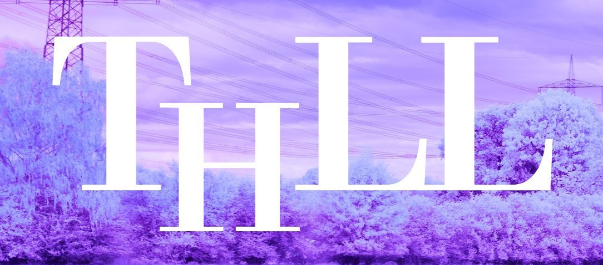

<p align="center">
    
</p>

<div align="center">
    <sup><a href="logo/thll.tex">Logo independently developed, not by De Gruyter</a></sup>
</div> 

<p align="center"><strong>An open-source implementation of <em>Thesaurus Linguae Latinae</em> (ThLL) on LaTeX</strong></p>

<div align="center">
    <a href="https://creativecommons.org/licenses/by-nc-nd/4.0/">
        
        
        
        
    </a>
</div>

<sup></sup>

<div align="center" style="margin-bottom: .5em;">
    <a href="LICENSE"></a>
</div>

<sup></sup>

## *A face-to-face*


<div><sup>On the left side is the open-source implementation; whereas on the right, the original work.</sup></div>
<div><sup>Slight differences can be noticed in the position and in-letter spacing where the implementation is fairly close to the original.</sup></div>

## License

Code herein is under GPL 3.0; <sup>[a](LICENSE)</sup> whereas the contents and the design (e.g. the cover) of the dictionary are under De Gruyter's copyright, which have been released as an open access work <sup>[b][OA] [c][Example]</sup> under CC BY-NC-ND <sup>[d][CC]</sup>.

However, ThLL has been reimplemented under LaTeX to digitize older volumes with high quality, such as with (manual) formatting corrections which result from OCR (which is allowed by the license, and does not constitute an adaptation) <sup>[e][ND] [f][Adaptation]</sup>, and recent volumes with the same old better-looking style; not to mention, more transformative [^1], useful features in the time to come. 

> All in all, this project has been made in good faith, with hard work and is now open-source.

It's important to mention, besides other assets, about the license of the fonts used herein.

### Fonts

#### [Orgreave](fonts/Orgreave.ttf)

<div><sup>First of all, bit of background.</sup></div>

After arduous search, the Didone typeface <sup>[a][Didone]</sup> turns out to be the cover's boldface, of which a font called Orgreave, <sup>[b][Orgreave]</sup> from Roger White, shares the most resemblance to the original work where no other did. 

However, this font is found in many free font sites, where it's incorrectly regarded as licensed in either GPL or OFL as far as dedicated to the public domain <sup>[b][Orgreave] [c][Fontspace]</sup>. Furthermore, its original source, archived in Wayback Machine, <sup>[d][Archive]</sup> unfortunately doesn't include the original files, and thus had to be downloaded from these sites <sup>[e][1001]</sup>. 

Nonetheless, one of these sites, <sup>[e][1001]</sup> contains the original license files, [^2] which follows this disclaimer:

<details>
    <summary>
        <a href="https://www.1001freefonts.com/view-file/17045/T1JHUkVBX18uVFhU/orgrea--.txt">
            License</a></summary>
    
```
The attached font ORGREAVE is Copyright [c] Roger White - all
rights reserved. In using this font it will be taken that you have read and
agreed to the following conditions: [...]

Alteration of the character set of the font, and conversion to any
other font format is expressly forbidden. [...]

Provided this font is used for personal purposes then no fee is payable to
the author for [its] use. You may use this font yourself and may [share] (with friends)
provided that the copy contains all of the files from the original package. [...]

If this font is used for commercial purposes then the user agrees to make a
one off payment to the author of $25.00.

If this font is distributed as part of a collection which has not been
compiled by the author, the distributor agrees to pay to the author a 
royalty of $0.01 for each of the authors fonts which are included in the
collection, for each copy of the collection which is sold.

If this font is distributed on the cover of a magazine, then the magazine agrees to
pay to the author the sum of $0.01 for each of the authors fonts included in the
collection, multiplied by the certified number of copies of the magazine circulated. [...]

This font represents approximately 500 man-hours of work.
```

<sup>At the end, the author's address and email are followed, the last which may still be valid, <sup>[f][CIX]</sup> if the author can be still contacted.</sup>
</details>

In this case, the use of this font is non-commercial, and ThLL's end use is for research (and thus personal use) in virtually all cases, which wouldn't infringe the license; anyhow, the author's work is greatly appreciated. 

#### [GFS Didot][Didot-OTF]

After a long search, the typeface turns out to be on the same type as the boldface, e.g. Didot and Bodoni <sup>[a][Didone]</sup>, where their GFS fonts not only are similar, but also fully support Greek and Latin, are found as packages for LaTeX in CTAN, <sup>[b][GFSDidot] [c][GFSBodoni]</sup> and are licensed under the OFL, <sup>[d][Didot-OFL]</sup> a really nice find!

[^1]: A transformative use "communicates something new and different from the original or expands its utility, thus serving copyright’s overall objective of contributing to public knowledge" — *Authors Guild v. Google, Inc.* <sup>[g][EFF-IA]</sup>.

[^2]: The license is similar to the ones from his other fonts, which can be found at Wayback Machine.

___

<div align="center">
    <sup>SVG GPL logo taken from OpenClipArt
        <a href="https://openclipart.org/detail/89197/agpl%20license%20web%20badge%20(version%202)"><sup>a</sup></a>
        made by Brad Phillips
        <a href="https://openclipart.org/artist/pianoBrad"><sup>b</sup></a>
        under CC0 1.0 (i.e. Public Domain)
        <a href="https://creativecommons.org/publicdomain/zero/1.0/"><sup>c</sup></a>
    </sup>
</div>

<div align="center">
    <sup>Background image
        <a href="https://unsplash.com/photos/AKeb3CguZpw"><sup>a</sup></a>
        taken by Wolfgang Hasselmann
        <a href="https://unsplash.com/@wolfgang_hasselmann"><sup>b</sup></a>
        under Unsplash License
        <a href="https://unsplash.com/license"><sup>c</sup></a>
    </sup>
</div>

<sup></sup>

[OA]: https://thesaurus.badw.de/en/tll-digital/tll-open-access.html
[Example]: https://publikationen.badw.de/de/000094373
[CC]: https://creativecommons.org/licenses/by-nc-nd/4.0/
[ND]: https://creativecommons.org/faq/#combining-and-adapting-cc-material
[Adaptation]: https://libguides.ccga.edu/CC/adaptations
[EFF-IA]: https://www.eff.org/files/2022/07/07/hachette_v._internet_archive_-_internet_archives_memorandum_for_summary_judgment_.pdf
[Didone]: https://en.wikipedia.org/wiki/Didone_(typography)
[Orgreave]: https://fonts2u.com/orgreave-bold.font
[Fontspace]: https://www.fontspace.com/orgreave-font-f5866
[Archive]: https://web.archive.org/web/20040805135126/http://www.rogersfonts.org.uk/html/files8.html
[1001]: https://www.1001freefonts.com/orgreave.font
[CIX]: https://pcpromag.medium.com/before-the-web-there-was-cix-and-its-still-going-a3a5ef716c86
[GFSDidot]: https://www.ctan.org/pkg/gfsdidot
[GFSBodoni]: https://www.ctan.org/pkg/gfsbodoni
[Didot-OFL]: https://ctan.math.utah.edu/ctan/tex-archive/fonts/greek/gfs/gfsdidot/doc/OFL.txt
[Didot-OTF]: https://www.ctan.org/texarchive/fonts/greek/gfs/gfsdidot/opentype
